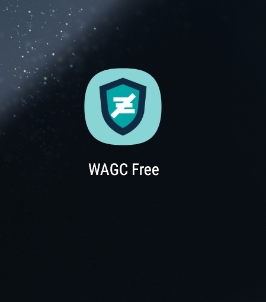
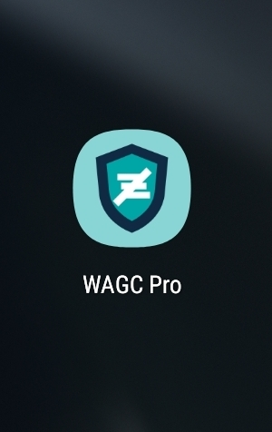
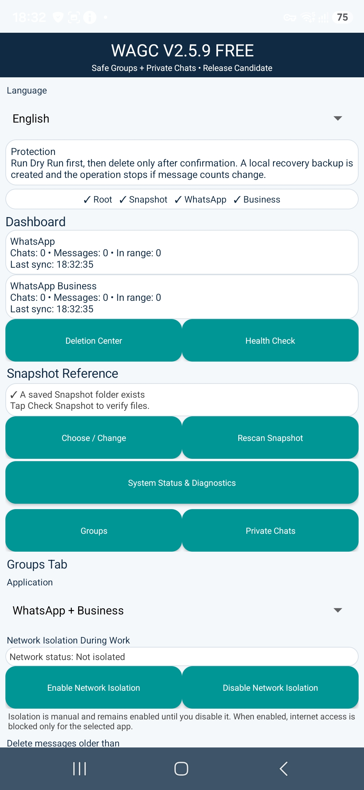
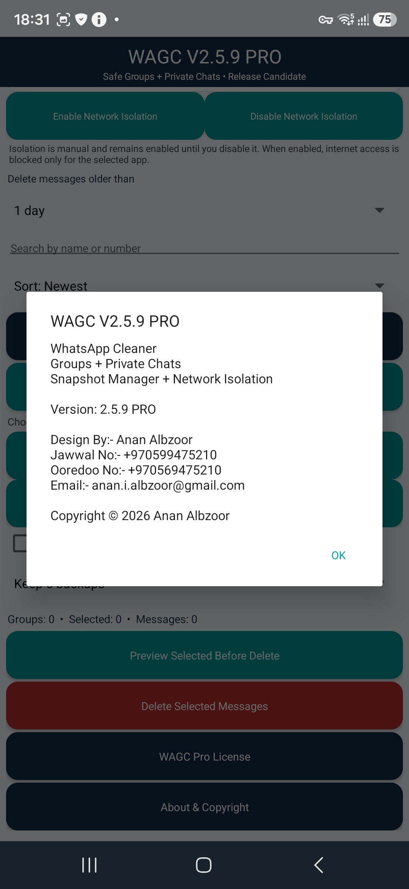
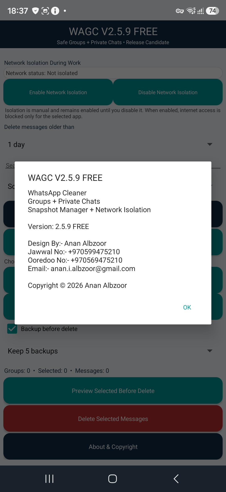
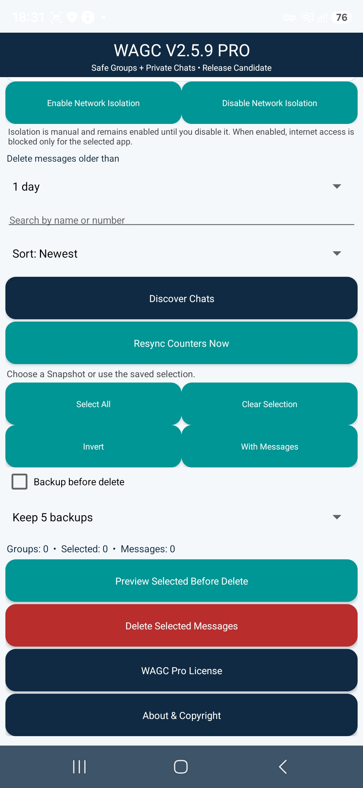
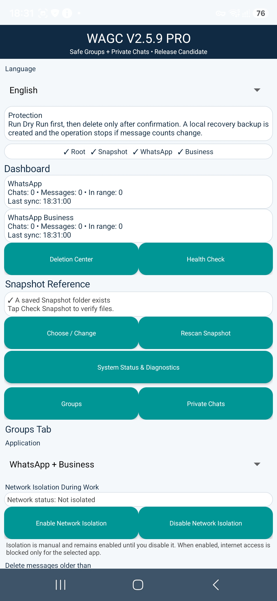

<div align="center">

# WAGC for Android
# WAGC لنظام Android

### Advanced WhatsApp Group Management & Cleanup
### إدارة وتنظيف متقدم لمجموعات ومحادثات WhatsApp

**Clean • Protect • Control**  
**تنظيف • حماية • تحكم**

**FREE & PRO Editions | Android 8.0+ | Root-Assisted Database Operations**  
**إصدارات FREE وPRO | Android 8.0+ | عمليات قواعد بيانات مدعومة بصلاحيات Root**

[](https://github.com/ananalbzoor86/WAGC/releases/tag/v2.5.9)
[](https://github.com/ananalbzoor86/WAGC/releases/download/v2.5.9/WAGC_V2.5.9_FREE.apk)
[](https://github.com/ananalbzoor86/WAGC/releases/download/v2.5.9/WAGC_V2.5.9_PRO.apk)

WAGC is a root-assisted Android utility for advanced WhatsApp and WhatsApp Business group and private-chat management, discovery, cleanup and maintenance.

WAGC هو تطبيق Android يعتمد على صلاحيات Root لتوفير أدوات متقدمة لإدارة واكتشاف وتنظيف وصيانة مجموعات ومحادثات WhatsApp وWhatsApp Business الخاصة.

This repository is the official public distribution, documentation and release-download location. The application source code is maintained privately and is not distributed here.

هذا المستودع هو الموقع العام الرسمي لتوزيع التطبيق والوثائق وتنزيل الإصدارات. يتم الاحتفاظ بالكود المصدري للتطبيق بشكل خاص ولا يتم توزيعه من خلال هذا المستودع.

</div>

---

## WAGC Showcase | معرض WAGC

<table>
<tr>
<td width="50%" align="center"><h3>WAGC FREE</h3><br><strong>Essential management and cleanup tools</strong><br><strong>أدوات الإدارة والتنظيف الأساسية</strong></td>
<td width="50%" align="center"><h3>WAGC PRO</h3><br><strong>Advanced controls and licensed PRO features</strong><br><strong>أدوات تحكم متقدمة وميزات PRO المرخصة</strong></td>
</tr>
</table>

### Interface Preview | معاينة الواجهة

<table>
<tr>
<td width="33%" align="center"><br><strong>FREE Dashboard | لوحة FREE</strong><br><sub>System status, protection and management overview<br>نظرة عامة على حالة النظام والحماية والإدارة</sub></td>
<td width="33%" align="center"><br><strong>PRO Dashboard | لوحة PRO</strong><br><sub>Advanced management and diagnostic controls<br>أدوات الإدارة والتشخيص المتقدمة</sub></td>
<td width="33%" align="center"><br><strong>Application Overview | نظرة على التطبيق</strong><br><sub>Additional WAGC interface view<br>عرض إضافي لواجهة WAGC</sub></td>
</tr>
</table>

<table>
<tr>
<td width="50%" align="center"><br><strong>PRO Management | إدارة PRO</strong><br><sub>Discovery, selection, preview and cleanup workflow<br>الاكتشاف والتحديد والمعاينة والتنظيف</sub></td>
<td width="50%" align="center"><br><strong>About & Copyright | حول التطبيق والحقوق</strong><br><sub>Version and developer information<br>معلومات الإصدار والمطور</sub></td>
</tr>
</table>

<div align="center">

**Official WAGC V2.5.9 FREE & PRO interface showcase**  
**المعرض الرسمي لواجهات WAGC V2.5.9 FREE وPRO**

</div>

---

## Core Capabilities | الإمكانيات الأساسية

| Capability / الميزة | Description / الوصف |
|---|---|
| **Groups + Private Chats / المجموعات والمحادثات الخاصة** | Manage supported group and private-chat cleanup workflows / إدارة عمليات التنظيف المدعومة للمجموعات والمحادثات الخاصة |
| **WhatsApp + Business** | Designed to work with compatible WhatsApp and WhatsApp Business installations / مصمم للعمل مع إصدارات WhatsApp وWhatsApp Business المتوافقة |
| **Safe Cleanup / التنظيف الآمن** | Confirmation-oriented cleanup workflow with preview controls / عمليات تنظيف مع التأكيد والمعاينة قبل التنفيذ |
| **Snapshot Management / إدارة Snapshot** | Local snapshot reference and recovery-oriented workflow / إدارة النسخ المرجعية المحلية للمساعدة في الاستعادة |
| **Network Isolation / عزل الشبكة** | Network isolation controls for supported operations / أدوات للتحكم بعزل الشبكة أثناء العمليات المدعومة |
| **Live Discovery / الاكتشاف المباشر** | Discover and rescan supported chats and groups / اكتشاف وإعادة فحص المحادثات والمجموعات المدعومة |
| **Counter Resync / مزامنة العدادات** | Reconcile supported message and unread-state counters / إعادة مزامنة عدادات الرسائل وحالة غير المقروء المدعومة |
| **Root Integration / تكامل Root** | Root-assisted access for operations that require database-level access / استخدام صلاحيات Root للعمليات التي تحتاج وصولاً إلى مستوى قاعدة البيانات |
| **FREE + PRO** | Freely available FREE edition and licensed PRO functionality / إصدار FREE متاح مجاناً ووظائف PRO تعمل بترخيص |

Feature availability may differ between FREE and PRO editions.  
قد يختلف توفر بعض الميزات بين إصداري FREE وPRO.

## Editions | الإصدارات

| | WAGC FREE | WAGC PRO |
|---|---|---|
| **Availability / التوفر** | Free download / تنزيل مجاني | Public APK download / ملف APK متاح للتنزيل |
| **License / الترخيص** | No PRO license required / لا يحتاج ترخيص PRO | Valid WAGC PRO license required / يحتاج ترخيص WAGC PRO صالح |
| **Purpose / الاستخدام** | Essential WAGC functionality / الوظائف الأساسية | Advanced functionality and controls / الوظائف وأدوات التحكم المتقدمة |
| **Source Code / الكود المصدري** | Private / خاص | Private / خاص |

> **FREE** means the freely available edition of WAGC. It does not mean that the source code is open source or released for unrestricted reuse.  
> **FREE** تعني أن هذا الإصدار من WAGC متاح مجاناً، ولا تعني أن الكود المصدري مفتوح المصدر أو مسموحاً بإعادة استخدامه دون قيود.

---

## WAGC PRO Plans & Payment | خطط وأسعار WAGC PRO والدفع

### PRO Subscription Prices | أسعار اشتراكات PRO

| Plan / الخطة | Price / السعر |
|---|---:|
| **Monthly / شهري** | **$3 USD** |
| **3 Months / 3 أشهر** | **$9 USD** |
| **6 Months / 6 أشهر** | **$18 USD** |
| **Yearly / سنوي** | **$36 USD** |
| **Lifetime / مدى الحياة** | **$40 USD** |

### Payment Method | طريقة الدفع

**Currency / العملة:** USDT  
**Network / الشبكة:** TRON (TRC20)  
**Wallet / المحفظة:** Binance

**USDT TRC20 Payment Address / عنوان الدفع USDT TRC20:**

```text
TDEubr9dXzgwYt3g5euyNcopURRm3KAeEZ
```

> **Important:** Send USDT only through the **TRON (TRC20)** network. Always verify the complete wallet address and selected network before confirming the transfer. Sending through a different network may result in loss of funds.  
> **مهم:** يجب إرسال USDT حصراً عبر شبكة **TRON (TRC20)**. تحقق دائماً من عنوان المحفظة كاملاً ومن اختيار الشبكة الصحيحة قبل تأكيد التحويل. الإرسال عبر شبكة مختلفة قد يؤدي إلى فقدان الأموال.

### Payment & PRO License Activation | الدفع وتفعيل ترخيص PRO

For payment confirmation and WAGC PRO license activation, contact via WhatsApp:  
لتأكيد الدفع وتفعيل ترخيص WAGC PRO، يرجى التواصل عبر WhatsApp:

- **Jawwal:** [+970 59 947 5210](https://wa.me/970599475210)
- **Ooredoo:** [+970 56 947 5210](https://wa.me/970569475210)

After payment, contact one of the WhatsApp numbers above to continue the PRO license activation process.  
بعد إتمام الدفع، تواصل عبر أحد رقمي WhatsApp أعلاه لاستكمال عملية تفعيل ترخيص PRO.

---

## Download WAGC V2.5.9 | تنزيل WAGC V2.5.9

| Edition / الإصدار | Official APK / ملف APK الرسمي | SHA-256 |
|---|---|---|
| **FREE** | [WAGC_V2.5.9_FREE.apk](https://github.com/ananalbzoor86/WAGC/releases/download/v2.5.9/WAGC_V2.5.9_FREE.apk) | `6feed11073403db412126e01e18f34bf04ce2e6555c009621017e5de0aa0ddb7` |
| **PRO** | [WAGC_V2.5.9_PRO.apk](https://github.com/ananalbzoor86/WAGC/releases/download/v2.5.9/WAGC_V2.5.9_PRO.apk) | `d3d821abac022684e4e6df272e1904a78890d17004e7087eaeee8485ee9f472b` |

**Official release / الإصدار الرسمي:** [WAGC V2.5.9](https://github.com/ananalbzoor86/WAGC/releases/tag/v2.5.9)

## Requirements | المتطلبات

- Android 8.0 or later / Android 8.0 أو أحدث
- Root access for database operations / صلاحيات Root لعمليات قواعد البيانات
- Compatible WhatsApp and/or WhatsApp Business installation / تثبيت متوافق من WhatsApp و/أو WhatsApp Business
- Valid WAGC PRO license for PRO-only functionality / ترخيص WAGC PRO صالح لاستخدام وظائف PRO

## Installation | التثبيت

1. Download the required APK from the official WAGC GitHub Release. / قم بتنزيل ملف APK المطلوب من إصدار WAGC الرسمي على GitHub.
2. Verify its SHA-256 checksum before installation. / تحقق من بصمة SHA-256 قبل التثبيت.
3. Allow installation from the source used to open the APK if Android requests it. / اسمح بالتثبيت من المصدر المستخدم لفتح APK إذا طلب Android ذلك.
4. Install and launch WAGC. / ثبّت WAGC ثم شغله.
5. Grant the permissions required by the features you use. / امنح الصلاحيات المطلوبة للميزات التي تستخدمها.
6. Grant root access when requested for database-level operations. / امنح صلاحيات Root عند طلبها للعمليات التي تحتاج وصولاً لقاعدة البيانات.
7. For PRO functionality, complete the WAGC licensing process. / لاستخدام ميزات PRO، أكمل عملية ترخيص WAGC.

### Verify SHA-256 on Windows | التحقق من SHA-256 على Windows

```bat
certutil -hashfile "WAGC_V2.5.9_FREE.apk" SHA256
certutil -hashfile "WAGC_V2.5.9_PRO.apk" SHA256
```

Compare the result with the official checksum in the download table above.  
قارن النتيجة مع بصمة SHA-256 الرسمية الموجودة في جدول التنزيل أعلاه.

---

## PRO Licensing | ترخيص PRO

The PRO APK can be downloaded from the official public release, but PRO functionality requires a valid WAGC license. Distribution of the APK does not grant a PRO license, ownership of WAGC, or access to its private source code.

يمكن تنزيل ملف PRO APK من الإصدار العام الرسمي، ولكن وظائف PRO تتطلب ترخيص WAGC صالحاً. تنزيل أو توزيع ملف APK لا يمنح ترخيص PRO ولا ملكية WAGC ولا حق الوصول إلى الكود المصدري الخاص.

## Security | الأمان

- Download WAGC only from this repository's official Releases section. / قم بتنزيل WAGC فقط من قسم Releases الرسمي في هذا المستودع.
- Verify SHA-256 before installing an APK. / تحقق من SHA-256 قبل تثبيت ملف APK.
- Avoid modified or repackaged builds from untrusted sources. / تجنب النسخ المعدلة أو المعاد حزمها من مصادر غير موثوقة.
- Private signing material, credentials and licensing secrets are not distributed through this repository. / مفاتيح التوقيع الخاصة وبيانات الاعتماد وأسرار نظام الترخيص لا يتم توزيعها عبر هذا المستودع.
- Review [SECURITY.md](SECURITY.md) for security and vulnerability-reporting guidance. / راجع [SECURITY.md](SECURITY.md) للحصول على تعليمات الأمان والإبلاغ عن الثغرات.

## Source Code | الكود المصدري

This is a **public distribution repository**, not the WAGC development source repository.  
هذا **مستودع توزيع عام** وليس مستودع تطوير الكود المصدري لـ WAGC.

The application source code, private development history, build internals and licensing implementation are maintained separately and are not distributed here.  
يتم الاحتفاظ بالكود المصدري للتطبيق وسجل التطوير الخاص وتفاصيل البناء ونظام الترخيص بشكل منفصل ولا يتم توزيعها هنا.

GitHub's automatically generated `Source code (zip)` and `Source code (tar.gz)` archives for releases contain only the public files associated with the public release tag. They are not archives of the private WAGC application source repository.  
ملفات `Source code (zip)` و`Source code (tar.gz)` التي ينشئها GitHub تلقائياً للإصدارات تحتوي فقط على الملفات العامة المرتبطة بوسم الإصدار العام، ولا تحتوي على الكود المصدري الخاص لتطبيق WAGC.

## Documentation | الوثائق

| Resource / المورد | Description / الوصف |
|---|---|
| [Releases](https://github.com/ananalbzoor86/WAGC/releases) | Official APK downloads and release information / تنزيل ملفات APK الرسمية ومعلومات الإصدارات |
| [CHANGELOG.md](CHANGELOG.md) | Version history and release changes / سجل الإصدارات والتغييرات |
| [SECURITY.md](SECURITY.md) | Security policy and reporting guidance / سياسة الأمان وتعليمات الإبلاغ |
| [LICENSE.md](LICENSE.md) | Distribution and usage terms / شروط التوزيع والاستخدام |

## Disclaimer | إخلاء المسؤولية

WAGC is an independent third-party utility and is not affiliated with, endorsed by, or sponsored by WhatsApp LLC or Meta Platforms, Inc.  
WAGC أداة مستقلة من طرف ثالث وليست تابعة أو معتمدة أو مدعومة من WhatsApp LLC أو Meta Platforms, Inc.

Users are responsible for using WAGC in accordance with applicable laws, platform terms and the permissions applicable to the data and devices they manage.  
يتحمل المستخدم مسؤولية استخدام WAGC بما يتوافق مع القوانين المعمول بها وشروط المنصات والصلاحيات المطبقة على البيانات والأجهزة التي يقوم بإدارتها.

---

<div align="center">

### WAGC V2.5.9

**FREE & PRO • Android • Public Distribution Repository**  
**FREE وPRO • Android • مستودع التوزيع العام الرسمي**

**Cleaner WhatsApp • Safer Data • Better Control**  
**WhatsApp أنظف • بيانات أكثر أماناً • تحكم أفضل**

© 2026 Anan Albzoor. All rights reserved.  
© 2026 Anan Albzoor. جميع الحقوق محفوظة.

</div>
